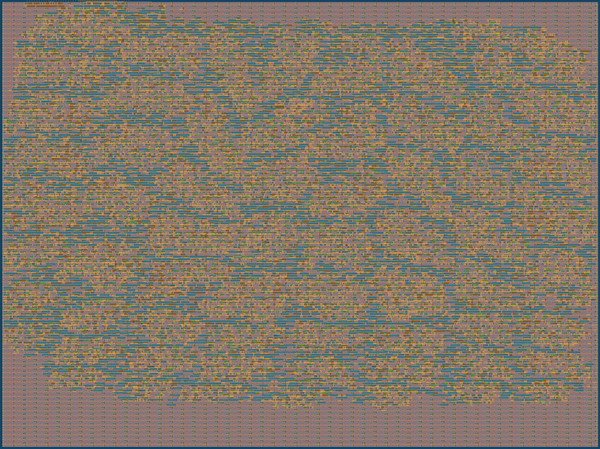

# Edge-AI NPU Core: 8x8 INT4 Systolic Array

A small, tapeout-ready hardware AI accelerator: an 8x8 weight-stationary systolic array for INT4 matrix
multiplication, implemented in SystemVerilog and hardened to GDSII on the SkyWater 130nm PDK as a
[Tiny Tapeout](https://tinytapeout.com/) project.

| | |
|---|---|
| **Tapeout status** | SUCCESS (GDSII generated) |
| **Process node** | SkyWater 130nm (`sky130_fd_sc_hd`) |
| **Silicon area** | 8x2 Tiny Tapeout tiles |
| **Precision** | INT4 weights & activations, INT16 accumulators |
| **Dataflow** | Weight-stationary systolic array |
| **Verification** | [cocotb](https://docs.cocotb.org/) — RTL and gate-level simulation |
| **Clock** | 50 MHz |



## Architecture

Instead of reading and writing memory for every calculation like a standard CPU, this core streams data
continuously through a grid of Processing Elements (PEs), maximizing throughput for matrix multiplication.

- **Processing Elements** — 64 custom MAC cores arranged in an 8x8 grid (`src/processing_element.sv`). Each
  PE latches one INT4 weight, then multiplies incoming INT4 activations by that weight and accumulates into
  a signed INT16 partial sum as it passes the result down the column.
- **Systolic array** — `src/systolic_array_8x8.sv` wires the 64 PEs into an 8x8 grid: activations flow left
  to right, partial sums flow top to bottom.
- **Input staging buffer** — `src/input_buffer.sv` is an 8-to-32-bit shift register that assembles four
  8-bit input bytes into one 32-bit activation word before it enters the array, bridging the narrow 8-bit
  Tiny Tapeout pad frame to the array's wider internal datapath.
- **Top level / output mux** — `src/tt_um_npu_core.sv` is the Tiny Tapeout wrapper. It drives the input
  buffer and array, and multiplexes the 128-bit internal result bus (8 columns x 16-bit accumulators) down
  to the 8-bit `uo_out` pins, selected by `col_sel` and `byte_sel`.

See [`docs/info.md`](docs/info.md) for the full pin-level protocol and [`info.yaml`](info.yaml) for the
Tiny Tapeout pinout definition.

## Repository layout

```
.
├── src/                    RTL sources (SystemVerilog) + OpenLane hardening config
│   ├── tt_um_npu_core.sv       Top-level Tiny Tapeout wrapper
│   ├── systolic_array_8x8.sv   8x8 grid of processing elements
│   ├── processing_element.sv   Single INT4 MAC / systolic cell
│   ├── input_buffer.sv         8-bit → 32-bit input staging buffer
│   └── config.json             OpenLane physical synthesis configuration
├── test/                   cocotb testbench (RTL + gate-level simulation)
│   ├── test.py                 Wavefront test
│   ├── tb.v                    Verilog test harness / DUT instantiation
│   └── Makefile
├── docs/
│   ├── info.md                 Tiny Tapeout project datasheet (how it works / how to test)
│   └── images/gds_render.png   Routed GDSII layout render
└── info.yaml                Tiny Tapeout project + pinout definition
```


## Building and testing

Requires [Icarus Verilog](http://iverilog.icarus.com/) and Python 3.

```sh
cd test
pip install -r requirements.txt
make -B
```

This runs the cocotb testbench against the RTL sources in `src/`. To run the same test against the hardened
gate-level netlist instead (after hardening the design with OpenLane), copy the resulting netlist to
`test/gate_level_netlist.v` and run:

```sh
make -B GATES=yes
```

See [`test/README.md`](test/README.md) for more detail, and [`docs/info.md`](docs/info.md) for the
stimulus/read-out protocol the testbench drives.

## The tapeout journey

Getting from RTL to a routed, working GDSII layout surfaced a few real physical-design problems worth
documenting:

1. **Single-trigger logic trap.** In SystemVerilog, a `logic` variable driven only inside an `initial` block
   or combinational process linked to an input pin can evaluate once and then stop tracking the pin. All
   control paths were re-architected around continuous (`assign`) wiring to keep a live physical connection
   to the external pads.

2. **Area constraint: INT4 quantization.** The initial design used INT8 multipliers and INT32 accumulators.
   Under OpenLane physical synthesis this exceeded the 8x2-tile area budget and caused a global placement
   failure. Since hardware multiplier area scales roughly quadratically with operand width, dropping to INT4
   weights/activations (INT16 accumulators) shrank the logic footprint enough for the full 64-PE grid to
   route comfortably within the tile budget.

3. **Gate-level setup/hold violations.** During gate-level simulation (GLS) the routed SkyWater 130nm
   flip-flops went metastable, producing a stream of `X` (unknown) states. The fix: drive testbench inputs
   on the `FallingEdge` of the clock instead of the rising edge, giving the physical nets a full half-cycle
   of propagation time before the clock edge that captures them.

4. **X-poisoning at time zero.** At the start of GLS, the clock could tick before `rst_n` was driven to a
   known value, poisoning the entire 8x8 grid with `X` states that never cleared. The fix: a `Timer(1, "ns")`
   at the start of the testbench forces every input pin to a defined `0`/`1` before the clock starts.

5. **OpenLane power tie-off.** In gate-level elaboration the chip failed to power on because the synthesized
   netlist left the standard-cell power nets (`VPWR`/`VGND`) floating. A `$deposit` call, compiled in only
   under the `GL_TEST` macro (see `test/tb.v`), forces those nets to valid logic levels for simulation
   without altering the physical layout that gets taped out.

## Verification

The core is verified with a cycle-accurate cocotb testbench (`test/test.py`) run against both the RTL and
the routed SkyWater 130nm gate-level netlist. The test loads a uniform matrix of weights, floods the array
with activations, and checks that the accumulated partial sums ripple down the systolic columns as expected
— proving the wavefront dataflow end-to-end on real physical-design output, not just RTL.


